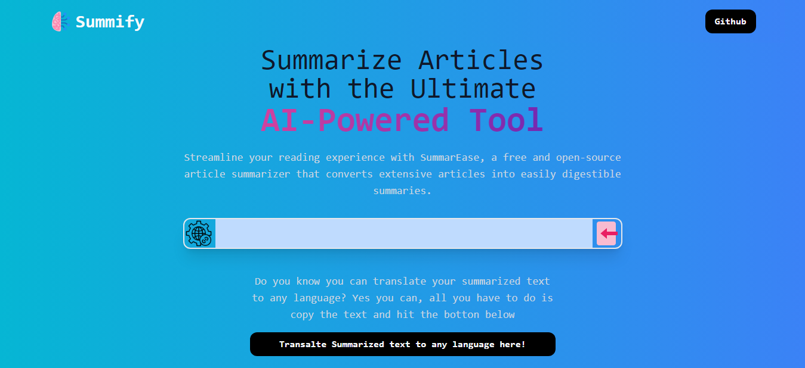

# Summify

Summify, powered by GPT AI, offers the remarkable ability to distill the essence of web page content into concise, easy-to-read summaries. With this innovative tool, users can quickly grasp the key points and important information from lengthy articles, news stories, or blog posts, saving them valuable time and effort in their online research. Whether for staying informed, conducting research, or simply getting a quick overview of a topic, your app provides a convenient and efficient way to access the most relevant content, empowering users to make well-informed decisions and stay ahead in the information age.

# Technology used

- Built with Reactjs, TailwindCSS and GPT AI
- The web speech API in JavaScript was used to tranplate the text to speech
- Tha Asynchronous clipboard API was used to build the copy funtionality

## Screenshots

## [Click me for a live preview](https://summiffy.netlify.app/)

## Authors

- [@giftednathan](https://www.github.com/giftednathan)

# Hi, I'm Nathaniel! 👋

## 🚀 About Me

I'm a frontend developer and a professional wordpress web designer

## 🛠 Skills

React, Javascript, WordPress HTML, CSS...

## 🔗 Links

## Support

For any project, email eje.nathaniel@gmail.com

## Thank you
